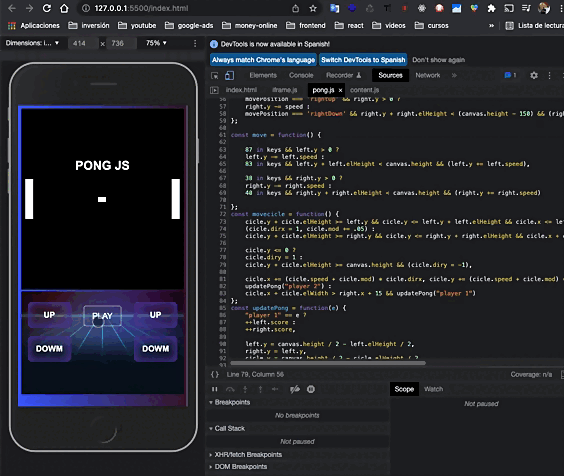

## Pong JS :video_game:

En Desktop se puede jugar 02 personas con en el mismo teclado
| Jugadores   |      Subir      |  Bajar |
|----------|:-------------:|------:|
| Jugador 1 | tecla (W) | tecla (S) |
| Jugador 2 | pulsar flecha arriba |  pulsar flecha abajo |

Para la versión mobile sólo esta activo los botones "UP/DOWN"

<a href="https://juniomarquesmartins.github.io/PongJS/" target="_blank">>>Jugar al Pong<<</a>